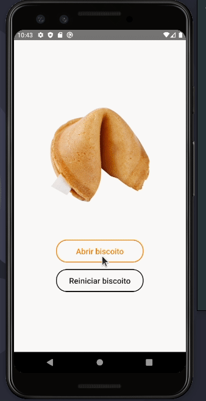

# Biscoito da Sorte

*Esta é uma aplicação mobile desenvolvida em react native que sorteia uma frase aleatoria para o usuário.*

*Como funciona esta aplicação:*

##### * Para usar a aplicação o usuário deve apenas pressionar o botão "Abrir biscoito". Após pressionado o botão, o biscoito da sorte irá se quebrar, sorteando uma frase aleatória para ele.
 

# Nesta aplicação foram usadas as seguintes tecnologias:

### * React Native
 
 

<h1 align="center">
    
</h1>